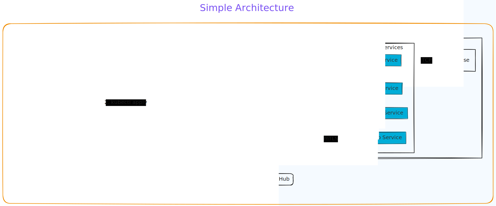
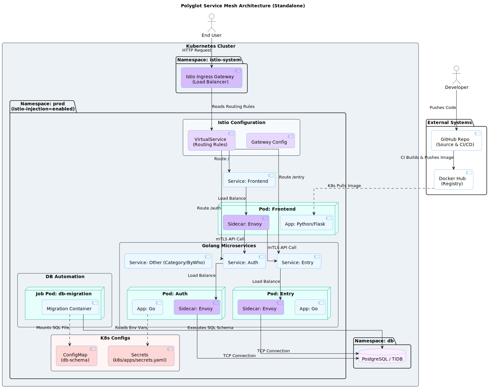

# 🕸️ Polyglot Service Mesh (Go, Python, Istio)

[](https://github.com/your-username/your-repo/actions)
[](https://kubernetes.io/)
[](https://istio.io/)
[](https://www.docker.com/)
[](https://opensource.org/licenses/MIT)

A cloud-native distributed application demonstrating **GitOps principles**, **Service Mesh traffic management**, and **Advanced CI/CD patterns**.

This project solves the challenge of managing a polyglot architecture (Python Frontend + Go Microservices) by implementing a **Smart Monorepo Pipeline** and fully declarative infrastructure on Kubernetes.

---

## ⚡ Architecture Overview (The 30-Second View)
The system is decomposed into 5 decoupled microservices communicating over an Istio Service Mesh.



---

## 🚀 Key Engineering Features

### 1. Smart Monorepo CI/CD (Matrix Strategy)
Instead of a linear build pipeline, this project uses a **GitHub Actions Matrix Strategy** to optimize build times and costs.
* **Change Detection:** The pipeline analyzes git history to detect *exactly* which folders (`backend/auth`, `frontend`, etc.) have changed.
* **Parallel Execution:** It spawns parallel build jobs only for the modified services using dynamic matrix generation.
* **Result:** Drastically reduced CI minutes and faster feedback loops.

### 2. Service Mesh Traffic Management
Replaced standard Kubernetes Ingress with **Istio** to unlock advanced L7 routing and observability.
* **Istio Gateway:** Single entry point acting as a Load Balancer.
* **VirtualServices:** Fine-grained routing rules that direct traffic based on URI prefixes (`/auth`, `/category`) to specific backend services.
* **Sidecar Proxies:** Envoy proxies are automatically injected (`istio-injection=enabled`) to handle mTLS and metrics without changing application code.

### 3. Declarative Infrastructure & Automation
* **Infrastructure as Code:** All resources (Deployments, Services, Gateways) are version-controlled in the `kubernetes/` directory.
* **Database Automation:** Database schemas are applied automatically using a **Kubernetes Job** (`db-migration.yaml`) that spins up a transient pod to execute SQL migrations upon deployment.

---

## 🛠️ Deep Dive Architecture

Below is the detailed view of the runtime environment, including the **Istio Control Plane**, **Sidecar injection**, and **Data Plane** communication flows.



### Service Inventory
| Service | Language | Port | Description |
| :--- | :--- | :--- | :--- |
| **Frontend** | Python (Flask) | `3000` | Serves the UI and aggregates backend API calls. |
| **Auth** | Go (Golang) | `8081` | Handles user authentication and session management. |
| **By_Who** | Go (Golang) | `8082` | Manages author/user metadata. |
| **Category** | Go (Golang) | `8083` | Manages content categorization logic. |
| **Entry** | Go (Golang) | `8084` | Core CRUD service for application entries. |

---

## ⚡ Getting Started

### Prerequisites
* Docker & Minikube (or any K8s cluster)
* `kubectl` and `istioctl` installed
* `make` (Optional, for developer convenience)

### Option A: Quick Deployment (Using Makefile)
I have included a `Makefile` to standardize the developer experience.

1. **Build Images:** (Points Docker CLI to Minikube)
	```bash
	eval $(minikube docker-env)
	make build-all
	```

2. **Deploy Stack:**
	```bash
	make deploy
	```


### Option B: Manual Deployment (Standard kubectl)

If you prefer to see exactly what is happening under the hood:

```bash
# 1. Establish Networking & Namespace
kubectl apply -f kubernetes/ns.yaml
kubectl apply -f kubernetes/istio/

# 2. Configure Secrets & Database
kubectl apply -f kubernetes/apps/secrets.yaml
kubectl apply -f kubernetes/apps/db-configmap.yaml

# 3. Deploy Applications & Migration Jobs
kubectl apply -R -f kubernetes/apps/
```

### Verification

Once deployed, verify the mesh status:

```bash
# Check if pods are running (should see 2/2 for Sidecar injection)
kubectl get pods -n prod

# Get the Istio Gateway URL
kubectl get svc istio-ingressgateway -n istio-system

```

---

## 📂 Repository Structure

The repository follows a clean separation of concerns between **Source Code**, **Infrastructure Manifests**, and **Automation**.

```text
.
├── .github/workflows   # CI/CD: Smart Pipeline with Matrix Strategy
├── Makefile            # Developer Automation (Build/Deploy shortcuts)
├── backend/            # Golang Microservices Source Code
├── frontend/           # Python (Flask) Source Code
├── kubernetes/         # Infrastructure as Code (Manifests)
│   ├── apps/           # Microservices, Secrets, & DB Jobs
│   ├── istio/          # Gateway & VirtualService Definitions
│   └── ns.yaml         # Namespace Configuration
├── full_architecture.svg    # Detailed System Design
└── simple_architecutre.svg  # High-Level Overview

```

---

### 👤 Author

**Yagnesh Jariwala**
*DevOps Engineer | Cloud-Native Enthusiast*

[LinkedIn](https://www.google.com/search?q=https://www.linkedin.com/in/yagnesh-jariwala-70273128b/) | [GitHub](https://github.com/codewithyagnesh)
